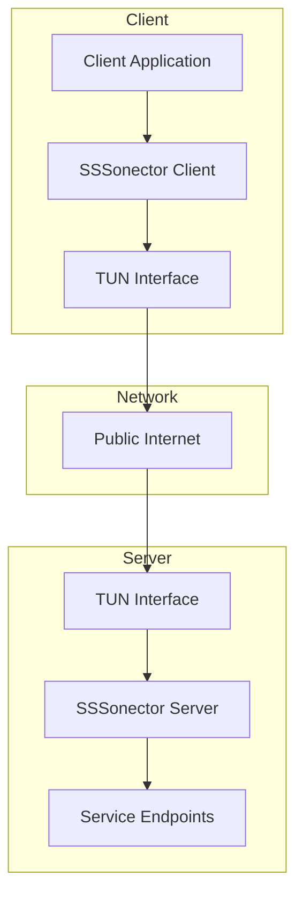
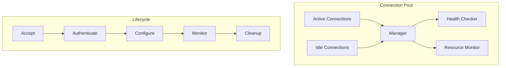
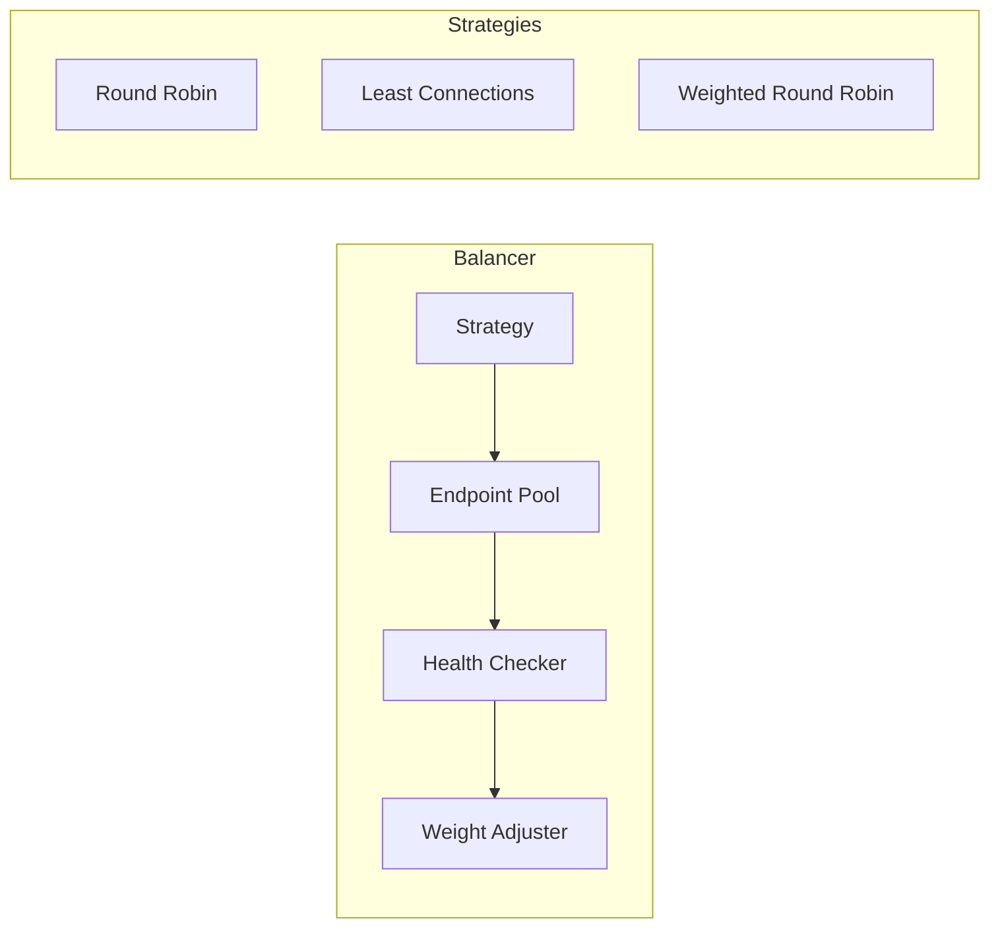
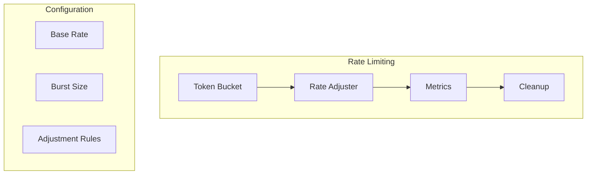
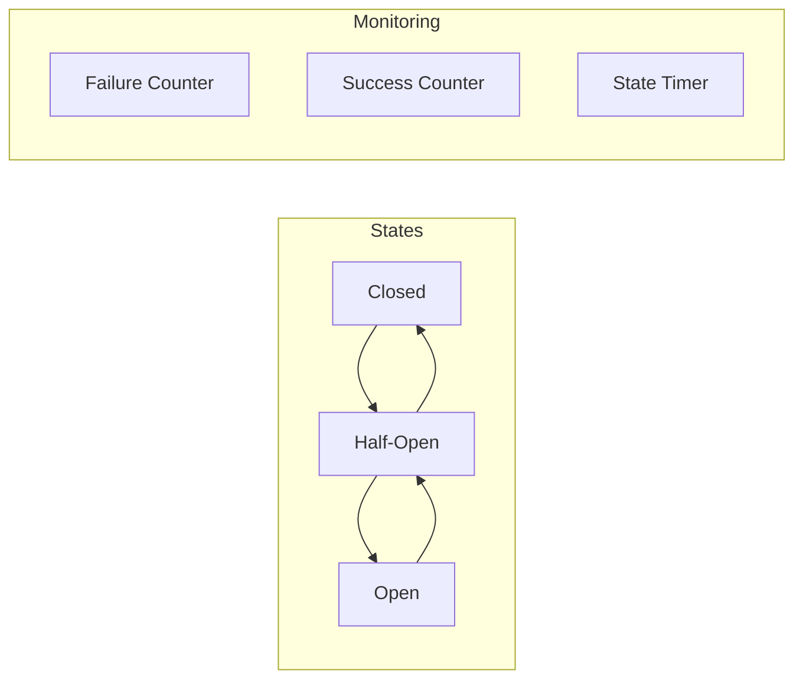
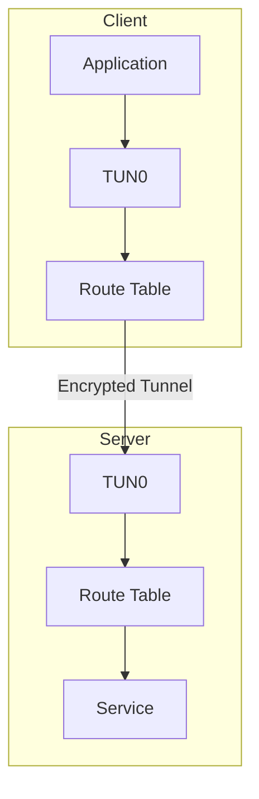
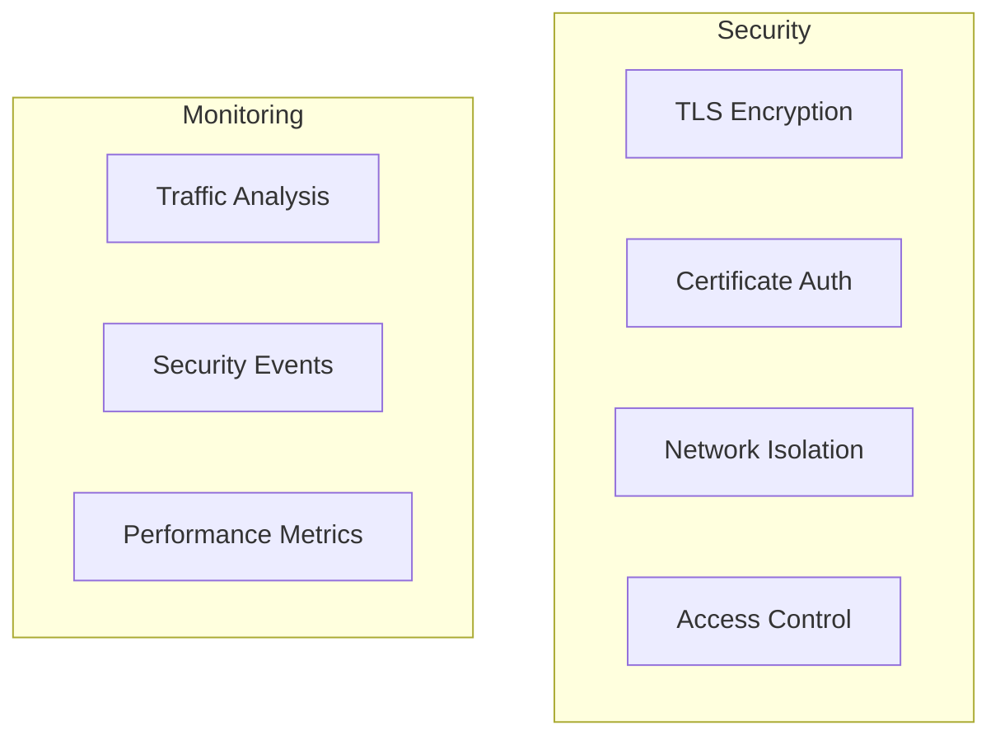
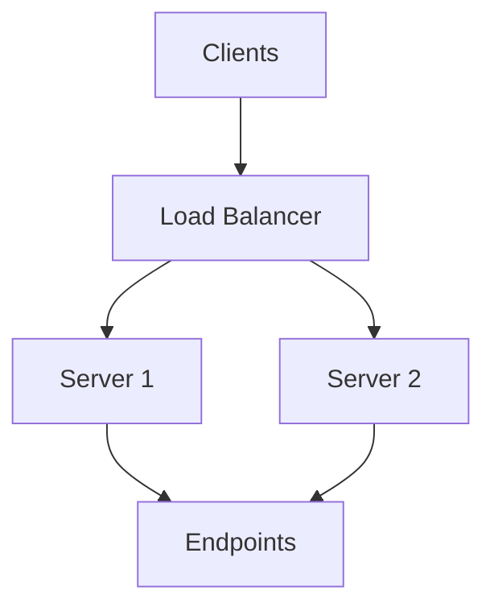
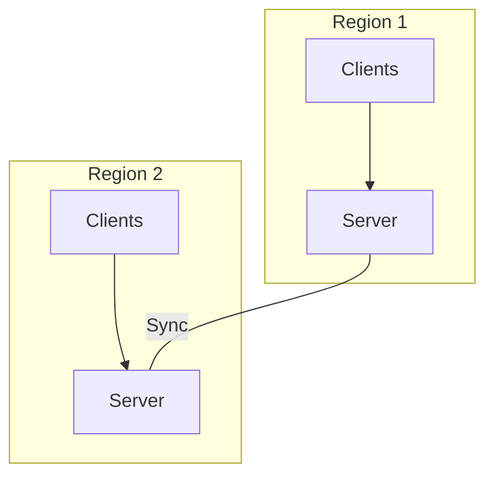

# SSSonector Architecture Guide

## Overview
This document provides a comprehensive overview of SSSonector's architecture, including system components, data flows, deployment patterns, and design considerations.

## Table of Contents
1. [System Architecture](#system-architecture)
2. [Component Design](#component-design)
3. [Network Architecture](#network-architecture)
4. [Data Flow](#data-flow)
5. [Deployment Patterns](#deployment-patterns)
6. [Performance Characteristics](#performance-characteristics)

## System Architecture

### High-Level Architecture



### Core Components

1. **Connection Manager**
   - Connection pooling
   - Connection lifecycle management
   - Resource cleanup
   - Health monitoring

2. **Load Balancer**
   - Multiple balancing strategies
   - Health checking
   - Automatic failover
   - Dynamic weight adjustment

3. **Rate Limiter**
   - Token bucket implementation
   - Dynamic rate adjustment
   - Per-connection limits
   - Burst handling

4. **Circuit Breaker**
   - Failure detection
   - State management
   - Automatic recovery
   - Half-open state handling

## Component Design

### Connection Manager



### Load Balancer



### Rate Limiter



### Circuit Breaker



## Network Architecture

### TUN Interface Setup



### Network Flow

1. **Client Side**
   - Application sends data to TUN interface
   - Packets are intercepted by SSSonector
   - Data is encrypted and tunneled
   - Rate limiting applied
   - Circuit breaking monitored

2. **Server Side**
   - Encrypted data received
   - Authentication verified
   - Data decrypted
   - Forwarded to service
   - Responses handled similarly

### Security Layers



## Data Flow

### Request Flow

```sequence
Client->TUN: Application Data
TUN->SSS Client: Intercept
SSS Client->Rate Limiter: Check Limits
Rate Limiter->Circuit Breaker: Check State
Circuit Breaker->Load Balancer: Get Endpoint
Load Balancer->SSS Server: Forward Request
SSS Server->Service: Process
Service->SSS Server: Response
SSS Server->Client: Return Data
```

### Control Flow

```sequence
Monitor->Health Check: Status
Health Check->Load Balancer: Update Weights
Health Check->Circuit Breaker: Update State
Monitor->Rate Limiter: Adjust Rates
Monitor->Metrics: Update
```

## Deployment Patterns

### Single Server


### High Availability



### Multi-Region



## Performance Characteristics

### Resource Usage

1. **Memory**
   - Base: 50MB
   - Per Connection: ~256KB
   - Buffer Pool: Configurable

2. **CPU**
   - Encryption: Moderate
   - Rate Limiting: Low
   - Connection Management: Low

3. **Network**
   - Overhead: ~10%
   - Compression: Optional
   - Buffer Sizes: Configurable

### Scalability Metrics

1. **Connection Scaling**
   - Maximum Connections: 10,000/server
   - Connection Rate: 1,000/second
   - Memory Growth: Linear

2. **Throughput**
   - Maximum: Network limited
   - Latency Overhead: <1ms
   - Encryption Impact: ~5%

### Performance Tuning

1. **Connection Pool**
   ```yaml
   pool:
     initial_size: 100
     max_size: 1000
     idle_timeout: 300s
     cleanup_interval: 60s
   ```

2. **Buffer Configuration**
   ```yaml
   buffers:
     size: 32KB
     pool_size: 1000
     prealloc: true
     cleanup_interval: 30s
   ```

3. **Rate Limiting**
   ```yaml
   rate_limit:
     base_rate: 10000
     burst_size: 1000
     adjustment_interval: 1s
   ```

## System Requirements

### Minimum Requirements
- CPU: 2 cores
- Memory: 1GB
- Network: 100Mbps
- Disk: 1GB

### Recommended Requirements
- CPU: 4+ cores
- Memory: 4GB
- Network: 1Gbps
- Disk: 10GB

### Operating System Support
- Linux (recommended)
- Windows
- macOS (Darwin)

## Monitoring and Metrics

### Key Metrics

1. **Connection Metrics**
   - Active connections
   - Connection rate
   - Error rate
   - Latency

2. **Performance Metrics**
   - Throughput
   - CPU usage
   - Memory usage
   - Network I/O

3. **Health Metrics**
   - Component status
   - Error rates
   - Resource usage
   - Queue depths

### Monitoring Integration

```yaml
monitoring:
  prometheus:
    enabled: true
    port: 9090
    path: /metrics
  logging:
    level: info
    format: json
    output: stdout
```

## Appendix

### Configuration Reference

```yaml
# Core Configuration
core:
  mode: server
  workers: 4
  max_connections: 1000

# Network Configuration
network:
  interface: tun0
  mtu: 1500
  compression: true

# Security Configuration
security:
  tls:
    enabled: true
    min_version: "1.2"
  certificates:
    auto_reload: true
    rotation_interval: 24h

# Performance Configuration
performance:
  buffer_size: 32KB
  tcp_keepalive: true
  connection_timeout: 30s
```

### Architecture Decisions

1. **TUN Interface**
   - Provides network level integration
   - Supports all IP protocols
   - Efficient packet handling
   - Cross-platform support

2. **Connection Pooling**
   - Reduces connection overhead
   - Improves resource usage
   - Enables connection reuse
   - Simplifies management

3. **Rate Limiting**
   - Protects resources
   - Ensures fair usage
   - Dynamic adjustment
   - Burst handling

4. **Circuit Breaking**
   - Prevents cascading failures
   - Enables graceful degradation
   - Automatic recovery
   - Failure isolation
