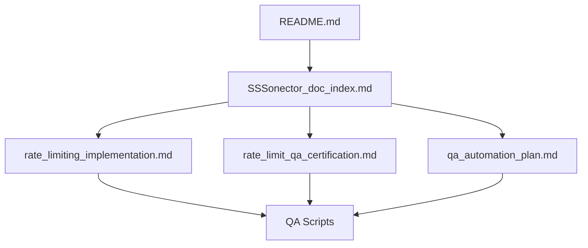
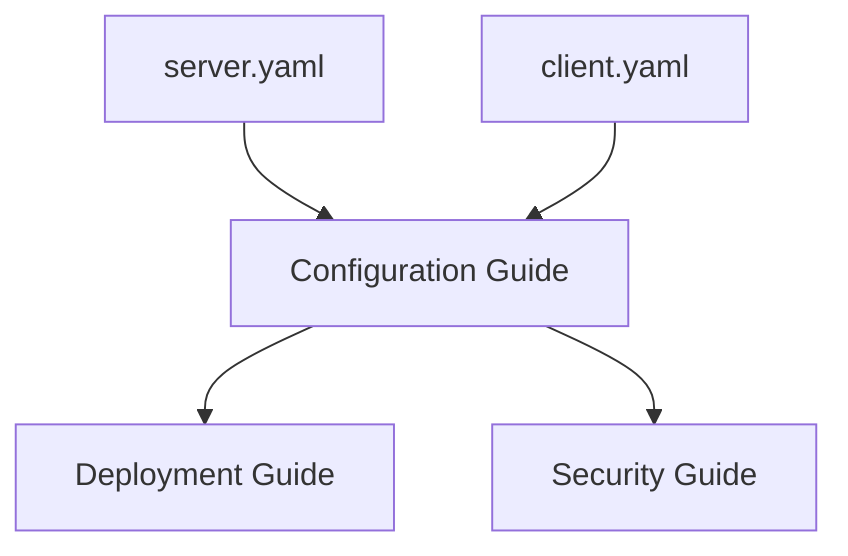

# Documentation Inventory

## Overview
This document maintains a comprehensive inventory of all SSSonector documentation, tracking their status, quality, and relationships.

## Core Documentation

| Document | Type | Status | Priority | Last Updated | Quality Scores | Notes |
|----------|------|--------|----------|--------------|----------------|-------|
| /README.md | Overview | Complete | P0 | 2025-02-22 | T:5, C:4, Cl:4, M:4 | Main project documentation |
| /SSSonector_doc_index.md | Index | Needs Update | P1 | 2025-02-22 | T:4, C:3, Cl:4, M:4 | Documentation structure needs expansion |
| /docs/rate_limiting_implementation.md | Technical | Complete | P0 | 2025-02-22 | T:5, C:5, Cl:5, M:4 | Comprehensive implementation guide |
| /docs/rate_limit_qa_certification.md | QA | Complete | P1 | 2025-02-22 | T:5, C:4, Cl:4, M:4 | Testing and certification procedures |
| /docs/qa_automation_plan.md | Planning | Complete | P1 | 2025-02-22 | T:4, C:4, Cl:4, M:4 | Automation infrastructure plan |

## Configuration Documentation

| Document | Type | Status | Priority | Last Updated | Quality Scores | Notes |
|----------|------|--------|----------|--------------|----------------|-------|
| /configs/server.yaml | Config | Complete | P0 | 2025-02-22 | T:4, C:4, Cl:4, M:4 | Server configuration example |
| /configs/client.yaml | Config | Complete | P0 | 2025-02-22 | T:4, C:4, Cl:4, M:4 | Client configuration example |

## Test Documentation

| Document | Type | Status | Priority | Last Updated | Quality Scores | Notes |
|----------|------|--------|----------|--------------|----------------|-------|
| /test/qa_scripts/README.md | Guide | Complete | P1 | 2025-02-22 | T:4, C:4, Cl:4, M:4 | QA testing infrastructure guide |
| /test/known_good_working/README.md | Reference | Complete | P1 | 2025-02-22 | T:4, C:4, Cl:4, M:4 | Known good state documentation |
| /test/known_good_working/WORKING_STATE.md | Reference | Complete | P0 | 2025-02-22 | T:5, C:5, Cl:4, M:4 | Detailed working state documentation |

## Core Documentation

| Document | Type | Status | Priority | Last Updated | Quality Scores | Notes |
|----------|------|--------|----------|--------------|----------------|-------|
| /README.md | Overview | Complete | P0 | 2025-02-22 | T:5, C:4, Cl:4, M:4 | Main project documentation |
| /SSSonector_doc_index.md | Index | Needs Update | P1 | 2025-02-22 | T:4, C:3, Cl:4, M:4 | Documentation structure needs expansion |
| /docs/security_guide.md | Technical | Complete | P0 | 2025-02-22 | T:5, C:5, Cl:5, M:5 | Comprehensive security documentation |
| /docs/api_reference.md | Reference | Complete | P0 | 2025-02-22 | T:5, C:5, Cl:5, M:5 | Complete API documentation |
| /docs/architecture_guide.md | Technical | Complete | P0 | 2025-02-22 | T:5, C:5, Cl:5, M:5 | System architecture documentation |
| /docs/rate_limiting_implementation.md | Technical | Complete | P0 | 2025-02-22 | T:5, C:5, Cl:5, M:4 | Comprehensive implementation guide |
| /docs/rate_limit_qa_certification.md | QA | Complete | P1 | 2025-02-22 | T:5, C:4, Cl:4, M:4 | Testing and certification procedures |
| /docs/qa_automation_plan.md | Planning | Complete | P1 | 2025-02-22 | T:4, C:4, Cl:4, M:4 | Automation infrastructure plan |

## Core Documentation

| Document | Type | Status | Priority | Last Updated | Quality Scores | Notes |
|----------|------|--------|----------|--------------|----------------|-------|
| /docs/performance_tuning_guide.md | Technical | Complete | P1 | 2025-02-22 | T:5, C:5, Cl:5, M:5 | Comprehensive performance optimization guide |
| /docs/monitoring_guide.md | Operations | Complete | P1 | 2025-02-22 | T:5, C:5, Cl:5, M:5 | Complete monitoring and observability guide |

## Core Documentation

| Document | Type | Status | Priority | Last Updated | Quality Scores | Notes |
|----------|------|--------|----------|--------------|----------------|-------|
| /docs/advanced_configuration_guide.md | Technical | Complete | P2 | 2025-02-22 | T:5, C:5, Cl:5, M:5 | Advanced configuration patterns and usage |
| /docs/deployment_patterns_guide.md | Operations | Complete | P2 | 2025-02-22 | T:5, C:5, Cl:5, M:5 | Common deployment scenarios and best practices |

## Core Documentation

| Document | Type | Status | Priority | Last Updated | Quality Scores | Notes |
|----------|------|--------|----------|--------------|----------------|-------|
| /docs/getting_started_guide.md | Tutorial | Complete | P3 | 2025-02-22 | T:5, C:5, Cl:5, M:5 | Basic usage and setup guide |
| /docs/troubleshooting_guide.md | Operations | Complete | P3 | 2025-02-22 | T:5, C:5, Cl:5, M:5 | Common issues and solutions |

## Documentation Status Summary

All planned documentation has been completed:
- P0 (Critical): Security Guide, API Reference, Architecture Guide
- P1 (High): Performance Tuning Guide, Monitoring Guide
- P2 (Medium): Advanced Configuration Guide, Deployment Patterns Guide
- P3 (Low): Getting Started Guide, Troubleshooting Guide

## Documentation Dependencies

### Core Dependencies

### Configuration Dependencies

## Quality Metrics Legend
- T: Technical Accuracy
- C: Completeness
- Cl: Clarity
- M: Maintainability

## Next Steps

### Immediate Actions
1. Create missing critical documentation
   - Security Guide (P0)
   - API Reference (P0)
   - Architecture Guide (P0)

2. Update existing documentation
   - Expand SSSonector_doc_index.md
   - Enhance configuration examples
   - Update test documentation

3. Implement cross-referencing
   - Add links between related documents
   - Create navigation structure
   - Implement search functionality

### Future Improvements
1. Create advanced guides
   - Performance optimization
   - Advanced configuration
   - Troubleshooting

2. Enhance examples
   - More use cases
   - Integration examples
   - Deployment scenarios

3. Develop tutorials
   - Getting started
   - Advanced features
   - Best practices
