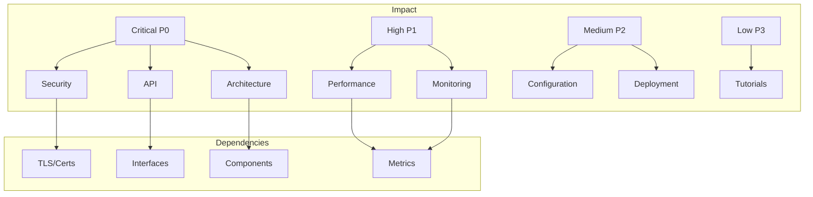

# Documentation Gap Analysis

## Overview
This document analyzes documentation gaps in the SSSonector project, assessing their impact, priority, and proposed solutions.

## Critical Gaps (P0)

### 1. Security Documentation
**Impact**: High
- Risk of security misconfigurations
- Potential vulnerabilities in deployment
- Lack of security best practices
- Missing compliance guidance

**Required Components**:
- Authentication/Authorization guide
- TLS configuration
- Certificate management
- Network security
- Access control
- Security best practices
- Compliance requirements
- Security testing procedures

**Dependencies**:
- Current TLS implementation
- Certificate generation scripts
- Security-related configuration options
- Access control mechanisms

**Timeline**: Immediate (1-2 weeks)

### 2. API Reference
**Impact**: High
- Difficulty in integration
- Increased support burden
- Development delays
- Integration errors

**Required Components**:
- Complete API specifications
- Interface definitions
- Protocol documentation
- Error codes and handling
- Rate limiting details
- Authentication methods
- Example requests/responses
- Integration guidelines

**Dependencies**:
- Current codebase
- Interface definitions
- Protocol implementations
- Error handling logic

**Timeline**: Immediate (1-2 weeks)

### 3. Architecture Guide
**Impact**: High
- System misunderstandings
- Suboptimal deployments
- Integration challenges
- Maintenance difficulties

**Required Components**:
- System architecture overview
- Component interactions
- Data flow diagrams
- Network architecture
- Deployment architectures
- Scaling considerations
- Performance characteristics
- System requirements

**Dependencies**:
- Current implementation
- Design decisions
- Performance requirements
- Scaling capabilities

**Timeline**: Immediate (1-2 weeks)

## High Priority Gaps (P1)

### 1. Performance Tuning Guide
**Impact**: Medium-High
- Suboptimal performance
- Resource inefficiency
- Scaling issues
- Configuration problems

**Required Components**:
- Performance optimization guidelines
- Resource sizing recommendations
- Configuration best practices
- Monitoring setup
- Benchmarking procedures
- Troubleshooting guide
- Scaling strategies
- Performance metrics

**Timeline**: Short-term (2-3 weeks)

### 2. Monitoring Guide
**Impact**: Medium-High
- Operational blindness
- Delayed issue detection
- Difficult troubleshooting
- Poor maintenance

**Required Components**:
- Monitoring setup guide
- Metrics documentation
- Alert configuration
- Dashboard setup
- Log analysis
- Health checks
- Performance monitoring
- Resource monitoring

**Timeline**: Short-term (2-3 weeks)

## Medium Priority Gaps (P2)

### 1. Advanced Configuration Guide
**Impact**: Medium
- Underutilized features
- Configuration confusion
- Support requests
- Implementation delays

**Required Components**:
- Advanced features documentation
- Complex configurations
- Optimization guidelines
- Integration patterns
- Example configurations
- Troubleshooting guide

**Timeline**: Medium-term (3-4 weeks)

### 2. Deployment Patterns Guide
**Impact**: Medium
- Suboptimal deployments
- Implementation challenges
- Integration issues
- Maintenance problems

**Required Components**:
- Common deployment patterns
- Integration examples
- Configuration templates
- Best practices
- Scaling strategies
- Migration guides

**Timeline**: Medium-term (3-4 weeks)

## Low Priority Gaps (P3)

### 1. Tutorial Documentation
**Impact**: Low-Medium
- Learning curve
- Implementation time
- Support requests
- User experience

**Required Components**:
- Getting started guide
- Step-by-step tutorials
- Example projects
- Best practices
- Common patterns
- Troubleshooting guide

**Timeline**: Long-term (4-6 weeks)

## Gap Analysis Matrix

## Implementation Strategy

### Phase 1: Critical Documentation (Weeks 1-2)
1. Security Documentation
   - Start with authentication/authorization
   - Add TLS/certificate management
   - Document security best practices
   - Include compliance guidance

2. API Reference
   - Document all interfaces
   - Add protocol specifications
   - Include error handling
   - Provide integration examples

3. Architecture Guide
   - Create system overview
   - Document component interactions
   - Add deployment architectures
   - Include scaling guidance

### Phase 2: High Priority Documentation (Weeks 3-4)
1. Performance Tuning Guide
   - Document optimization strategies
   - Add configuration guidelines
   - Include benchmarking procedures
   - Provide troubleshooting guidance

2. Monitoring Guide
   - Create setup instructions
   - Document metrics and alerts
   - Add dashboard configurations
   - Include maintenance procedures

### Phase 3: Medium Priority Documentation (Weeks 5-6)
1. Advanced Configuration Guide
   - Document complex features
   - Add integration patterns
   - Include optimization guidelines
   - Provide troubleshooting guidance

2. Deployment Patterns Guide
   - Document common patterns
   - Add integration examples
   - Include scaling strategies
   - Provide migration guidance

### Phase 4: Low Priority Documentation (Weeks 7-8)
1. Tutorial Documentation
   - Create getting started guide
   - Add step-by-step tutorials
   - Include example projects
   - Document best practices

## Success Metrics

### Documentation Completion
- All P0 gaps addressed
- P1 gaps significantly reduced
- P2/P3 gaps planned
- Quality metrics met

### Quality Metrics
- Technical accuracy: 4+/5
- Completeness: 4+/5
- Clarity: 4+/5
- Maintainability: 4+/5

### User Impact
- Reduced support requests
- Faster implementation time
- Fewer configuration issues
- Improved user satisfaction

## Next Steps

1. Immediate Actions
   - Begin security documentation
   - Start API reference
   - Initialize architecture guide

2. Resource Allocation
   - Assign documentation owners
   - Schedule technical reviews
   - Plan user feedback sessions

3. Timeline Management
   - Set documentation milestones
   - Schedule regular reviews
   - Track progress metrics
   - Update gap analysis
