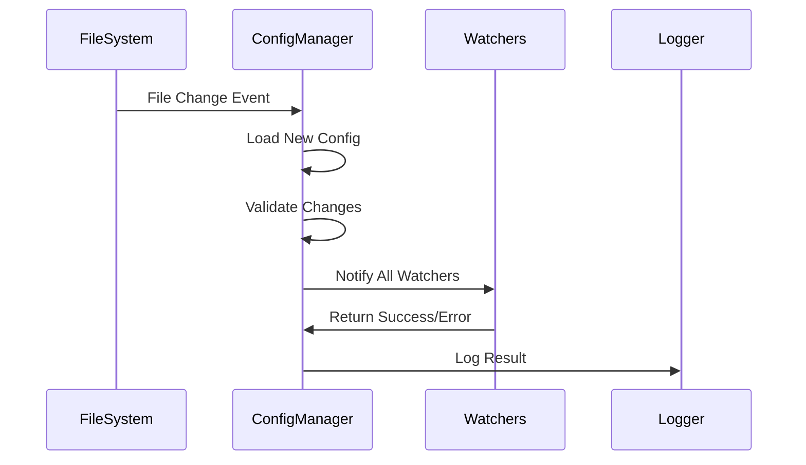

# Hot Reload Implementation Design

This document details the technical implementation of SSSonector's hot reload capability.

## Architecture Overview

### Core Components

1. ConfigManager
```go
type ConfigManager struct {
    mu            sync.RWMutex
    currentConfig *Config
    configPath    string
    watchers      []ConfigWatcher
    reloadChan    chan struct{}
    logger        *zap.Logger
    watcher       *fsnotify.Watcher
    done          chan struct{}
}
```

2. ConfigWatcher Interface
```go
type ConfigWatcher interface {
    OnConfigUpdate(*Config) error
}
```

### Component Interactions



## Implementation Details

### 1. Configuration Loading

```go
func (m *ConfigManager) handleConfigChange() {
    // Add small delay to ensure file is fully written
    time.Sleep(100 * time.Millisecond)

    // Load new configuration
    newConfig, err := LoadConfig(m.configPath)
    if err != nil {
        m.logger.Error("Failed to load new config",
            zap.String("path", m.configPath),
            zap.Error(err))
        return
    }

    // Validate and apply
    if err := m.validateConfigChange(newConfig); err != nil {
        m.logger.Error("Invalid configuration change",
            zap.Error(err))
        return
    }

    if err := m.applyNewConfig(newConfig); err != nil {
        m.logger.Error("Failed to apply new config",
            zap.Error(err))
        return
    }

    m.logger.Info("Configuration reloaded successfully")
}
```

### 2. Change Validation

```go
func (m *ConfigManager) validateConfigChange(newConfig *Config) error {
    // Validate mode hasn't changed
    if newConfig.Mode != m.currentConfig.Mode {
        return fmt.Errorf("cannot change mode during hot reload")
    }

    // Validate certificate paths exist if changed
    if newConfig.Tunnel.CertFile != m.currentConfig.Tunnel.CertFile {
        if _, err := os.Stat(newConfig.Tunnel.CertFile); err != nil {
            return fmt.Errorf("certificate file not accessible: %w", err)
        }
    }

    // Additional validations...
    return nil
}
```

### 3. Atomic Updates

```go
func (m *ConfigManager) applyNewConfig(newConfig *Config) error {
    m.mu.Lock()
    defer m.mu.Unlock()

    // Notify all watchers
    for _, w := range m.watchers {
        if err := w.OnConfigUpdate(newConfig); err != nil {
            return fmt.Errorf("failed to update component: %w", err)
        }
    }

    // Update current configuration
    m.currentConfig = newConfig
    return nil
}
```

## Component-Specific Implementations

### 1. Rate Limiter

```go
func (l *Limiter) OnConfigUpdate(cfg *Config) error {
    l.mu.Lock()
    defer l.mu.Unlock()

    l.enabled = cfg.Throttle.Enabled
    if l.enabled {
        // Update rate limits with new configuration
        adjustedUploadRate := rate.Limit(float64(cfg.Tunnel.UploadKbps*1024) * 1.05)
        adjustedDownloadRate := rate.Limit(float64(cfg.Tunnel.DownloadKbps*1024) * 1.05)
        uploadBurst := int(float64(cfg.Tunnel.UploadKbps*1024) * 0.1)
        downloadBurst := int(float64(cfg.Tunnel.DownloadKbps*1024) * 0.1)

        l.outLimit.SetLimit(adjustedUploadRate)
        l.outLimit.SetBurst(uploadBurst)
        l.inLimit.SetLimit(adjustedDownloadRate)
        l.inLimit.SetBurst(downloadBurst)
    }

    return nil
}
```

### 2. Monitor Integration

```go
func (m *Monitor) OnConfigUpdate(cfg *Config) error {
    if cfg.Monitor.SNMPEnabled != m.config.SNMPEnabled {
        if cfg.Monitor.SNMPEnabled {
            return m.startSNMP(cfg)
        }
        return m.stopSNMP()
    }
    return nil
}
```

## Signal Handling

```go
func (s *Server) handleSignals(sigCh chan os.Signal) {
    for {
        select {
        case sig := <-sigCh:
            switch sig {
            case syscall.SIGHUP:
                s.configManager.TriggerReload()
            case syscall.SIGINT, syscall.SIGTERM:
                s.Stop()
                return
            }
        }
    }
}
```

## Error Handling

### 1. Validation Errors

```go
type ConfigError struct {
    Field   string
    Message string
    Value   interface{}
}

func (e *ConfigError) Error() string {
    return fmt.Sprintf("invalid configuration for %s: %s (got: %v)",
        e.Field, e.Message, e.Value)
}
```

### 2. Recovery Mechanisms

```go
func (m *ConfigManager) handleConfigChange() {
    defer func() {
        if r := recover(); r != nil {
            m.logger.Error("Panic during config reload",
                zap.Any("panic", r))
            // Restore previous config
            m.currentConfig = m.loadBackup()
        }
    }()
    // ... normal handling
}
```

## Testing Strategy

### 1. Unit Tests

```go
func TestConfigValidation(t *testing.T) {
    tests := []struct {
        name    string
        oldCfg  *Config
        newCfg  *Config
        wantErr bool
    }{
        {
            name: "valid rate limit change",
            oldCfg: &Config{
                Throttle: ThrottleConfig{RateLimit: 1000},
            },
            newCfg: &Config{
                Throttle: ThrottleConfig{RateLimit: 2000},
            },
            wantErr: false,
        },
        // ... more test cases
    }
    // ... test implementation
}
```

### 2. Integration Tests

```go
func TestLiveReload(t *testing.T) {
    // Start server
    server := startTestServer(t)
    defer server.Stop()

    // Modify config
    modifyConfig(t, "rate_limit: 2000")

    // Verify changes
    assertConfigApplied(t, server)
}
```

## Performance Considerations

1. File System Events
   - Debounce configuration file changes
   - Buffer period for write completion
   - Efficient file reading

2. Atomic Updates
   - Lock granularity
   - Update ordering
   - Rollback capability

3. Memory Usage
   - Config versioning
   - Garbage collection
   - Resource cleanup

## Security Considerations

1. File Permissions
   - Configuration file ownership
   - Directory permissions
   - Process privileges

2. Validation
   - Input sanitization
   - Type checking
   - Range validation

3. Logging
   - Sensitive data handling
   - Audit trail
   - Error reporting

## Monitoring and Metrics

1. Configuration Events
   - Reload attempts
   - Success/failure rates
   - Validation errors

2. Performance Impact
   - Reload duration
   - Resource usage
   - Connection stability

3. Component Status
   - Watcher health
   - File system events
   - Component updates

## Future Improvements

1. Enhanced Validation
   - Schema-based validation
   - Custom validation rules
   - Dependency checking

2. Rollback Mechanisms
   - Automatic rollback
   - Version history
   - State recovery

3. Monitoring
   - Enhanced metrics
   - Health checks
   - Alert integration

4. Testing
   - Chaos testing
   - Load testing
   - Security testing
