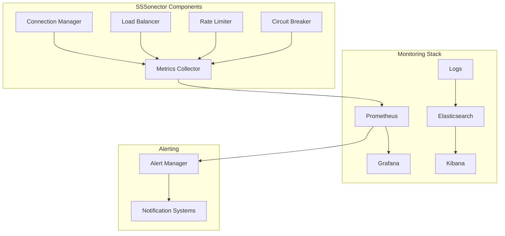

# SSSonector Monitoring Guide

## Overview
This guide provides comprehensive documentation for monitoring, alerting, and observability in SSSonector deployments.

## Table of Contents
1. [Monitoring Architecture](#monitoring-architecture)
2. [Metrics Collection](#metrics-collection)
3. [Logging System](#logging-system)
4. [Alert Configuration](#alert-configuration)
5. [Dashboard Setup](#dashboard-setup)
6. [Troubleshooting](#troubleshooting)

## Monitoring Architecture

### High-Level Design



### Component Integration
```yaml
monitoring:
  # Metrics endpoint
  prometheus:
    enabled: true
    port: 9090
    path: /metrics
    labels:
      service: sssonector
      environment: production

  # Logging configuration
  logging:
    format: json
    output: file
    level: info
    path: /var/log/sssonector/
```

## Metrics Collection

### Core Metrics

1. **Connection Metrics**
```yaml
metrics:
  connections:
    # Active connections
    sssonector_connections_active:
      type: gauge
      labels: [endpoint, type]
    
    # Connection rate
    sssonector_connections_total:
      type: counter
      labels: [endpoint, status]
    
    # Connection errors
    sssonector_connection_errors_total:
      type: counter
      labels: [endpoint, error_type]
    
    # Connection latency
    sssonector_connection_latency:
      type: histogram
      buckets: [0.1, 0.5, 1.0, 2.0, 5.0]
      labels: [endpoint]
```

2. **Performance Metrics**
```yaml
metrics:
  performance:
    # Throughput
    sssonector_throughput_bytes:
      type: counter
      labels: [direction]
    
    # Request rate
    sssonector_requests_total:
      type: counter
      labels: [endpoint, status]
    
    # Error rate
    sssonector_errors_total:
      type: counter
      labels: [type, endpoint]
```

3. **Resource Metrics**
```yaml
metrics:
  resources:
    # Memory usage
    sssonector_memory_bytes:
      type: gauge
      labels: [type]
    
    # CPU usage
    sssonector_cpu_usage:
      type: gauge
      labels: [type]
    
    # File descriptors
    sssonector_file_descriptors:
      type: gauge
```

### Prometheus Configuration

```yaml
global:
  scrape_interval: 15s
  evaluation_interval: 15s

scrape_configs:
  - job_name: 'sssonector'
    static_configs:
      - targets: ['localhost:9090']
    metrics_path: '/metrics'
    scheme: 'http'
    relabel_configs:
      - source_labels: [__address__]
        target_label: instance
```

## Logging System

### Log Configuration
```yaml
logging:
  # General configuration
  format: json
  level: info
  output: [file, stdout]
  
  # File rotation
  max_size: 100MB
  max_age: 7d
  max_backups: 5
  compress: true
  
  # Fields
  fields:
    service: sssonector
    environment: production
    version: ${VERSION}
```

### Log Format
```json
{
  "timestamp": "2025-02-22T22:04:55Z",
  "level": "info",
  "service": "sssonector",
  "component": "connection_manager",
  "message": "New connection established",
  "metadata": {
    "client_id": "client-123",
    "endpoint": "10.0.0.1:8080",
    "latency_ms": 15
  }
}
```

### Log Categories

1. **Operational Logs**
```yaml
categories:
  operational:
    - connection_events
    - rate_limit_events
    - circuit_breaker_events
    - load_balancer_events
```

2. **Security Logs**
```yaml
categories:
  security:
    - authentication_events
    - authorization_events
    - certificate_events
    - access_events
```

3. **Performance Logs**
```yaml
categories:
  performance:
    - latency_events
    - throughput_events
    - resource_events
    - error_events
```

## Alert Configuration

### Alert Rules

1. **Resource Alerts**
```yaml
groups:
  - name: resource_alerts
    rules:
      - alert: HighMemoryUsage
        expr: sssonector_memory_bytes > 0.9 * total_memory
        for: 5m
        labels:
          severity: warning
        annotations:
          summary: High memory usage detected
          
      - alert: HighCPUUsage
        expr: sssonector_cpu_usage > 0.8
        for: 5m
        labels:
          severity: warning
```

2. **Connection Alerts**
```yaml
groups:
  - name: connection_alerts
    rules:
      - alert: HighConnectionErrors
        expr: rate(sssonector_connection_errors_total[5m]) > 10
        labels:
          severity: critical
          
      - alert: ConnectionLatencyHigh
        expr: histogram_quantile(0.95, sssonector_connection_latency) > 1.0
        labels:
          severity: warning
```

3. **Service Alerts**
```yaml
groups:
  - name: service_alerts
    rules:
      - alert: ServiceDown
        expr: up{job="sssonector"} == 0
        for: 1m
        labels:
          severity: critical
          
      - alert: HighErrorRate
        expr: rate(sssonector_errors_total[5m]) / rate(sssonector_requests_total[5m]) > 0.05
        labels:
          severity: warning
```

### Alert Manager Configuration

```yaml
alertmanager:
  config:
    global:
      resolve_timeout: 5m
      slack_api_url: 'https://hooks.slack.com/services/XXX/YYY/ZZZ'
      
    route:
      group_by: ['alertname', 'cluster', 'service']
      group_wait: 30s
      group_interval: 5m
      repeat_interval: 4h
      receiver: 'slack-notifications'
      
    receivers:
      - name: 'slack-notifications'
        slack_configs:
          - channel: '#sssonector-alerts'
            send_resolved: true
```

## Dashboard Setup

### Grafana Dashboard Configuration

1. **Overview Dashboard**
```yaml
dashboard:
  title: SSSonector Overview
  refresh: 10s
  time_options: [5m, 15m, 1h, 6h, 12h, 24h, 7d]
  
  rows:
    - title: Connection Status
      panels:
        - title: Active Connections
          type: graph
          metrics:
            - sssonector_connections_active
        - title: Connection Rate
          type: graph
          metrics:
            - rate(sssonector_connections_total[5m])
            
    - title: Performance
      panels:
        - title: Throughput
          type: graph
          metrics:
            - rate(sssonector_throughput_bytes[5m])
        - title: Latency
          type: graph
          metrics:
            - histogram_quantile(0.95, sssonector_connection_latency)
```

2. **Resource Dashboard**
```yaml
dashboard:
  title: SSSonector Resources
  refresh: 30s
  
  rows:
    - title: System Resources
      panels:
        - title: Memory Usage
          type: gauge
          metrics:
            - sssonector_memory_bytes
        - title: CPU Usage
          type: gauge
          metrics:
            - sssonector_cpu_usage
            
    - title: Network Resources
      panels:
        - title: Network I/O
          type: graph
          metrics:
            - rate(sssonector_throughput_bytes{direction="in"}[5m])
            - rate(sssonector_throughput_bytes{direction="out"}[5m])
```

### Dashboard Panels

1. **Connection Panels**
```yaml
panels:
  connections:
    - title: Connection Overview
      type: stat
      metrics:
        - sssonector_connections_active
      thresholds:
        - value: 1000
          color: green
        - value: 5000
          color: yellow
        - value: 10000
          color: red
```

2. **Performance Panels**
```yaml
panels:
  performance:
    - title: Latency Distribution
      type: heatmap
      metrics:
        - sssonector_connection_latency
      options:
        yAxis:
          format: ms
        color:
          mode: spectrum
```

## Troubleshooting

### Common Issues

1. **Missing Metrics**
```yaml
symptoms:
  - No metrics in Prometheus
  - Incomplete dashboard data
solutions:
  - Verify metrics endpoint is accessible
  - Check Prometheus scrape configuration
  - Validate metric names and labels
  - Review service logs for errors
```

2. **Alert Issues**
```yaml
symptoms:
  - Missing alerts
  - False positives
  - Delayed notifications
solutions:
  - Verify alert rules syntax
  - Check AlertManager configuration
  - Validate notification channels
  - Review alert thresholds
```

### Debug Tools

1. **Metric Debugging**
```bash
# Check metrics endpoint
curl http://localhost:9090/metrics

# Query Prometheus
curl http://localhost:9090/api/v1/query?query=up

# Validate alerts
curl http://localhost:9090/api/v1/alerts
```

2. **Log Analysis**
```bash
# Search for errors
grep -i error /var/log/sssonector/*.log

# Check recent logs
tail -f /var/log/sssonector/sssonector.log | jq .

# Analyze log patterns
awk '{print $1}' /var/log/sssonector/sssonector.log | sort | uniq -c
```

## Best Practices

### Monitoring Setup
1. Use consistent naming conventions
2. Set appropriate retention periods
3. Configure backup and restore
4. Document custom metrics

### Alert Configuration
1. Set meaningful thresholds
2. Avoid alert fatigue
3. Include runbooks
4. Test alert paths

### Dashboard Organization
1. Group related metrics
2. Use consistent time ranges
3. Include documentation
4. Regular review and updates

## Appendix

### Metric Reference
```yaml
# Complete list of available metrics
metrics:
  # Connection metrics
  sssonector_connections_active: gauge
  sssonector_connections_total: counter
  sssonector_connection_errors_total: counter
  sssonector_connection_latency: histogram
  
  # Performance metrics
  sssonector_throughput_bytes: counter
  sssonector_requests_total: counter
  sssonector_errors_total: counter
  
  # Resource metrics
  sssonector_memory_bytes: gauge
  sssonector_cpu_usage: gauge
  sssonector_file_descriptors: gauge
```

### Alert Reference
```yaml
# Standard alert thresholds
thresholds:
  memory_usage: 90%
  cpu_usage: 80%
  error_rate: 5%
  latency_p95: 1s
  connection_errors: 10/5m
```

### Dashboard Templates
```yaml
# Standard dashboard layout
layout:
  overview:
    row1: [connections, throughput]
    row2: [errors, latency]
    row3: [resources, alerts]
  
  detailed:
    row1: [connection_details, error_details]
    row2: [resource_usage, network_io]
    row3: [logs, alerts]
