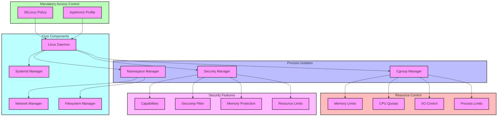
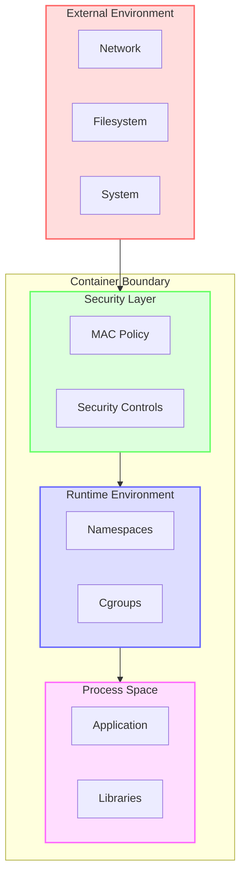
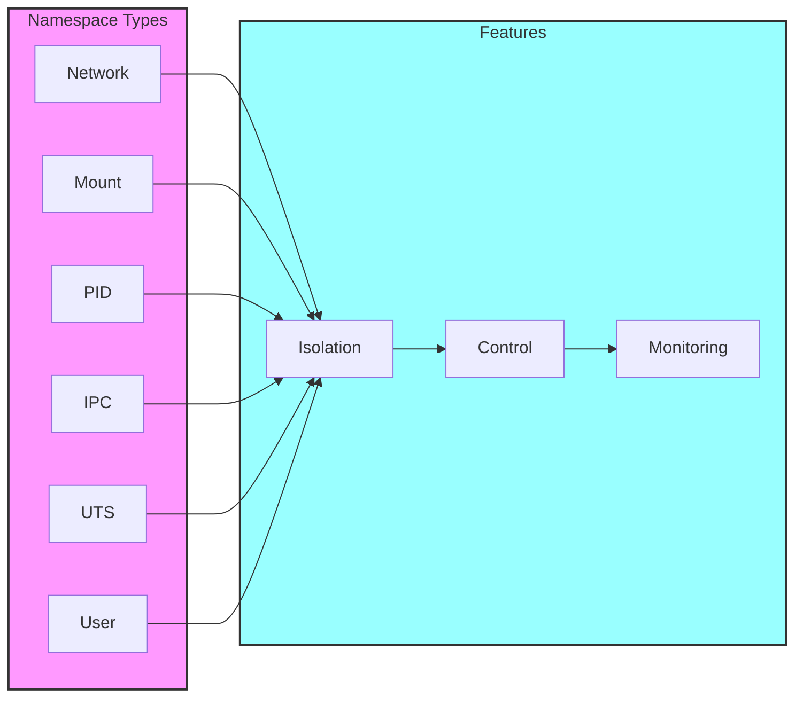
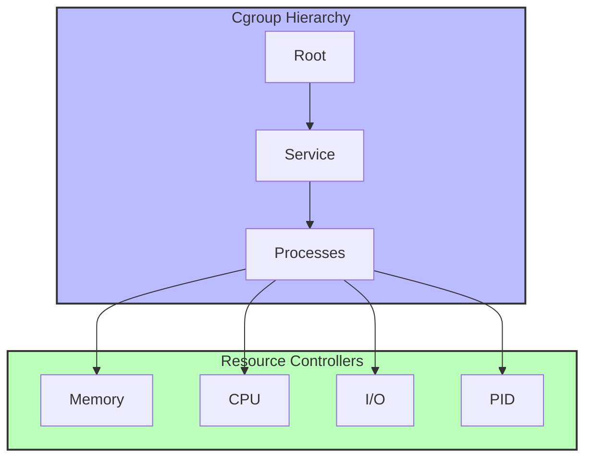

# Security Architecture



## Component Descriptions

### Process Isolation Layer
- **Namespace Manager**: Provides process isolation through Linux namespaces
- **Cgroup Manager**: Controls and monitors resource usage
- **Security Manager**: Implements system-wide security policies

### Mandatory Access Control Layer
- **SELinux Policy**: Enforces mandatory access control policies
- **AppArmor Profile**: Provides additional access control

### Resource Control Layer
- **Memory Limits**: Controls memory allocation and usage
- **CPU Quotas**: Manages CPU time allocation
- **I/O Control**: Regulates disk and network I/O
- **Process Limits**: Restricts process creation and management

### Security Features Layer
- **Capabilities**: Manages process capabilities
- **Seccomp Filter**: Filters system calls
- **Memory Protection**: Implements memory safety features
- **Resource Limits**: Enforces resource usage boundaries

### Core Components Layer
- **Linux Daemon**: Main service process
- **Systemd Manager**: Handles service lifecycle
- **Network Manager**: Manages network interfaces
- **Filesystem Manager**: Handles filesystem operations

## Security Flow

1. Process Initialization
   ```mermaid
   sequenceDiagram
       participant D as Daemon
       participant S as Security Manager
       participant N as Namespace Manager
       participant C as Cgroup Manager
       participant M as MAC

       D->>S: Initialize Security
       S->>S: Apply Security Policies
       D->>N: Setup Namespaces
       N->>N: Create Isolated Environment
       D->>C: Initialize Cgroups
       C->>C: Set Resource Limits
       D->>M: Apply MAC Policies
       M->>M: Enforce Access Control
   ```

2. Resource Management
   ```mermaid
   sequenceDiagram
       participant P as Process
       participant C as Cgroup Manager
       participant R as Resource Controller
       participant M as Monitor

       P->>C: Request Resources
       C->>R: Check Limits
       R->>R: Apply Quotas
       R->>C: Grant/Deny Request
       C->>P: Resource Response
       M->>C: Monitor Usage
       C->>M: Usage Statistics
   ```

3. Security Enforcement
   ```mermaid
   sequenceDiagram
       participant P as Process
       participant S as Security Manager
       participant F as Seccomp Filter
       participant M as MAC
       participant A as Audit

       P->>S: System Call
       S->>F: Filter Call
       F->>S: Allow/Deny
       S->>M: Check Policy
       M->>S: Policy Decision
       S->>P: Execute/Block
       S->>A: Log Event
   ```

## Security Boundaries



## Implementation Details

### Namespace Configuration


### Resource Control


### Security Policy
```mermaid
graph TB
    subgraph Policy["Security Policy"]
        MAC["MAC Rules"]
        DAC["DAC Rules"]
        CAP["Capabilities"]
    end

    subgraph Enforcement["Policy Enforcement"]
        SEL["SELinux"]
        AA["AppArmor"]
        SEC["Seccomp"]
    end

    subgraph Monitoring["Security Monitoring"]
        AUD["Audit"]
        LOG["Logging"]
        MON["Monitoring"]
    end

    Policy --> Enforcement
    Enforcement --> Monitoring

    classDef policy fill:#fbf,stroke:#333,stroke-width:2px;
    classDef enforcement fill:#bff,stroke:#333,stroke-width:2px;
    classDef monitoring fill:#ffb,stroke:#333,stroke-width:2px;

    class Policy policy;
    class Enforcement enforcement;
    class Monitoring monitoring;
